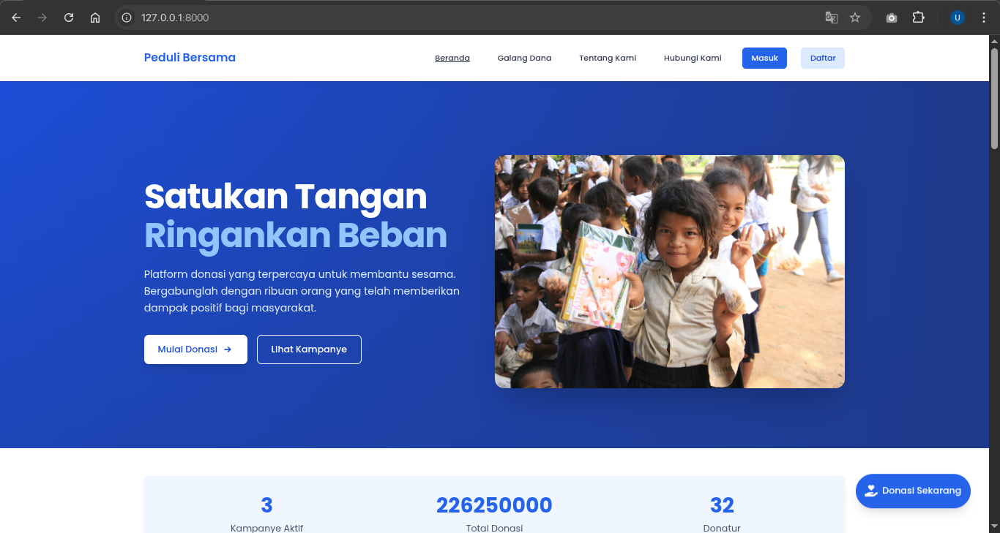

# 🌱 Peduli Bersama

Peduli Bersama adalah sebuah platform donasi online yang bertujuan untuk menjadi jembatan antara para donatur dan mereka yang membutuhkan. Website ini dirancang dengan sistem yang **mudah, aman, dan transparan**, agar siapa pun dapat berkontribusi dalam aksi sosial dan kemanusiaan.



---

## 📌 Latar Belakang

Di tengah masyarakat, kita sering menjumpai individu yang hidup dalam keterbatasan ekonomi, menderita penyakit berat, atau anak-anak yang kehilangan orang tua. Indonesia juga kerap dilanda bencana alam yang menyebabkan kerugian besar.

Namun, tidak semua orang tahu bagaimana cara menyalurkan bantuan secara tepat. Peduli Bersama hadir sebagai solusi digital untuk menjembatani niat baik dan kebutuhan nyata.

---

## 👥 Target Pengguna

- **Donatur**
  Menjelajahi campaign dan memberikan donasi.

- **Pengelola Donasi**
  Membuat dan mengelola campaign serta laporan pertanggungjawaban.

- **Publik**
  Mengakses informasi campaign tanpa perlu login.

- **Admin**
  Mengelola pengguna, konten, dan statistik website.

---

## ⚙️ Fitur

### 🛠️ Admin


- Login
- Kelola akun pengguna (username, password)
- Dashboard statistik:
  - Total donasi per kategori
  - Campaign aktif
  - Jumlah donatur
  - Pengguna aktif
- Kelola kritik dan saran
- Kelola kategori campaign
- Manajemen konten

---

### 💝 Donatur


- Login
- Jelajahi campaign berdasarkan kategori:
  - Bencana
  - Kurang mampu
  - Sakit
  - Yatim piatu
  - Pembangunan tempat ibadah
  - Dan sebagainya bisa diatur
- Lihat detail campaign
- Donasi dengan mudah
- Lihat statistik dan komentar
- Bagikan campaign ke media sosial
- Lihat riwayat donasi
- Komentar dan dukungan
- Kirim kritik dan saran

---

### 📢 Pengelola Donasi


- Login
- Buat campaign baru
- Unggah dokumentasi (foto/video)
- Lihat statistik donasi dan komentar
- Tarik dana donasi
- Buat laporan pertanggungjawaban
- Balas komentar publik

---

### 🌍 Publik


- Jelajahi dan cari campaign
- Lihat detail campaign
- Lihat statistik dan komentar
- Bagikan campaign ke media sosial
- Daftar akun
- Donasi

---

## 🚀 Teknologi yang Digunakan

- Laravel (PHP Framework)
- MySQL
- Blade Templating Engine
- Bootstrap (untuk antarmuka)

---

## 📦 Panduan Instalasi

### Persyaratan Sistem
- PHP >= 8.1
- Composer
- MySQL >= 5.7
- Git

### Langkah-langkah Instalasi

1. **Clone Repository**
   ```bash
   git clone https://github.com/username/peduli-bersama.git
   cd peduli-bersama
   ```

2. **Install Dependencies**
   ```bash
   composer install
   ```

3. **Konfigurasi Environment**
   ```bash
   cp .env.example .env
   php artisan key:generate
   ```
   Edit file `.env` dan sesuaikan konfigurasi database:
   ```
   DB_CONNECTION=mysql
   DB_HOST=127.0.0.1
   DB_PORT=3306
   DB_DATABASE=peduli_bersama
   DB_USERNAME=root
   DB_PASSWORD=
   ```

4. **Jalankan Migrasi dan Seeder**
   ```bash
   php artisan migrate
   php artisan db:seed
   ```

5. **Buat Symbolic Link untuk Storage**
   ```bash
   php artisan storage:link
   ```
   Jika masih terdapat masalah dengan symbolic link, hapus link `storage` yang ada pada `public/`

6. **Jalankan Server Development**
   ```bash
   php artisan serve
   ```

7. **Akses Website**
   Buka browser dan akses `http://127.0.0.1:8000`

### Akun Default
Setelah menjalankan seeder, beberapa akun default akan tersedia:

- **Admin**
  - Email: admin@pedulibersama.com
  - Password: admin

- **Donatur**
  - Email: donor@pedulibersama.com
  - Password: donor

- **Creator**
  - Email: creator@pedulibersama.com
  - Password: creator

---

## 📝 Catatan

Proyek ini dibangun untuk memenuhi kebutuhan sosial dengan pendekatan berbasis teknologi. Fokus utama adalah kemudahan penggunaan, transparansi pengelolaan dana, dan aksesibilitas untuk semua pihak.


---

## 📩 Kontak

Untuk pertanyaan atau kerja sama, silakan hubungi kami melalui email: `f1d02310141@student.unram.ac.id`
